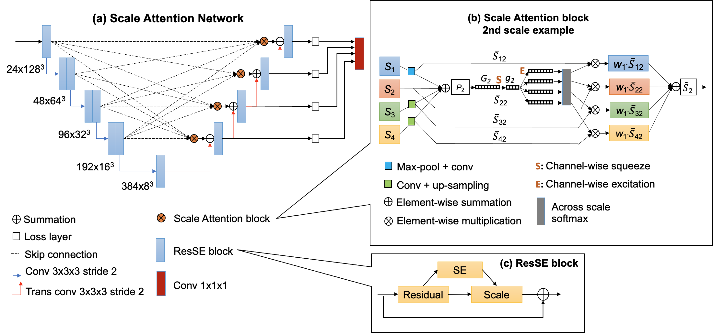

# Scale Attention Network (SA-Net) in Gossip Contrastive Mutual Learning (GCML)

## SA-Net

SA-Net is the segmentation model we used for GCML study. It was evaluated on various medical image segmentation 
tasks under various imaging modalities with top performance, such as the 2nd place in BraTS 2021 challenge.
More details can be found in the papers listed in the citation section.

## Use cases
### [SA-Net on BraTS21 dataset](SANet/BraTS/)
### [SA-Net on PanSeg dataset](SANet/PanSeg/)
### SA-Net on HECKTOR dataset (coming soon)
### GCML with SA-Net on BraTS21 dataset (coming soon)
### GCML with SA-Net on PanSeg dataset (coming soon)
### GCML with SA-Net on HECKTOR dataset (coming soon)

## License
The code is licensed under GPL-3.0 license.

## Citation
If you use this code for your research, please use the following BibTex entries:
```bibtex
@inbook{Yuan2022,
   author = {Yading Yuan},
   doi = {10.1007/978-3-031-09002-8_4},
   booktitle = {International MICCAI Brainlesion workshop},
   pages = {42-53},
   title = {Evaluating Scale Attention Network for Automatic Brain Tumor Segmentation with Large Multi-parametric MRI Database},
   year = {2022}
}
@article{Chen2025,
   author = {Jingyun Chen and Yading Yuan},
   doi = {10.1109/TMI.2025.3549292},
   issn = {0278-0062},
   journal = {IEEE Transactions on Medical Imaging},
   title = {Decentralized Personalization for Federated Medical Image Segmentation via Gossip Contrastive Mutual Learning},
   year = {2025}
}
```
