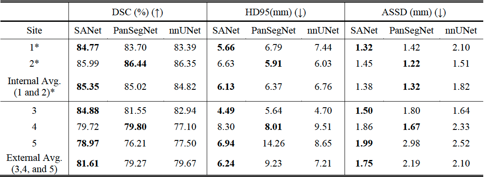

# Demo code for SA-Net model on PanSeg T1 MRI dataset

## 1. Create Conda Environment
```bash
conda config --set channel_priority flexible
conda env create -f env/panseg_environment.yml
conda activate panseg
```

## 2. Set input data paths
```bash
export PANSEG_PREPROCESSED_DATA=/Path/To/Your/PanSeg/Preprocessed/Data/
export PANSEG_RAW_DATA=/Path/To/Your/PanSeg/Raw/Data/
```
e.g. 
```bash
export PANSEG_PREPROCESSED_DATA=/data/lab/shared_data/results_FLpanseg24/pre_processed/v1_1.0x1.0x2.0/
export PANSEG_RAW_DATA=/data/lab/shared_data/results_FLpanseg24/
```
Please refer to section 5 for more details about input data

## 3. Train
```bash
source panseg_train.sh
```
Results will be generated under ```outputs_train/```, including trained model and log.

## 4. Test
```bash
source panseg_predict.sh model_type
```
where model_type can be ```best_val_loss```,```best_val_loss_ma``` or ```history```<br>
e.g. ```source panseg_predict.sh best_val_loss``` <br>
Results will be generated under ```outputs_predict/```, including segmentation masks and metrics sheet.

## 5. Input Data Structure 
### 5.1 Preprossed Data
For the purpose of benchmarking and fair compare with methods in the PanSeg paper[1] and nnUNet[2], the training code takes the nnUNET pre-processed PanSeg data, with following data structure:<br>
```bash
PANSEG_PREPROCESSED_DATA
├── imagesTr
│   ├── xxx.pkl
│   └── xxx.npy
└── labelsTr
    └── xxx.npy
```
where the .pkl and .npy files can be generaeted with nnUNet (V2) through following steps:<br>
1) Download the raw PanSeg data (including both training and testing cases) to your ```$nnUNet_raw``` directory and assign a ```DATASET_ID``` to it.
2) Preprocess the raw data:
```bash
nnUNetv2_plan_and_preprocess -d DATASET_ID --verify_dataset_integrity
````
3) Open the ```$nnUNet_preprocessed/DATASET_ID/nnUNetPlans.json``` generated from last step, and add a new plan 
```3d_fullres_v2``` with spacing ```1.0x1.0x2.0```, an example can be found in:
```bash
configs/nnUNetPlans.json
```
4) Generate preprocessed data for the new plan ```3d_fullres_v2```:
```bash
nnUNetv2_plan_and_preprocess -d DATASET_ID -c 3d_fullres_v2
```
5) Copy or link output files from ```$nnUNet_preprocessed/DATASET_ID/nnUNetPlans_3d_fullres_v2/``` to ```PANSEG_TRAIN_DATA```: <br>
```bash
PANSEG_PREPROCESSED_DATA
├── imagesTr
│   ├── xxx.pkl -> $nnUNet_preprocessed/DATASET_ID/nnUNetPlans_3d_fullres_v2/xxx.pkl  
│   └── xxx.npy -> $nnUNet_preprocessed/DATASET_ID/nnUNetPlans_3d_fullres_v2/xxx.npy
└── labelsTr
    └── xxx.npy -> $nnUNet_preprocessed/DATASET_ID/nnUNetPlans_3d_fullres_v2/xxx_seg.pkl
```
It is recommended to apply the above step to both training and testing cases.
Although the training code requires only the preprocessed training cases, the testing code requires the xxx.pkl for the testing cases in above folder. <br>

### 5.2 Raw Data
The testing code takes the raw PanSeg data, with standard nnUNet data structure:<br>
```bash
PANSEG_RAW_DATA
├── imagesTr
│   └── xxx.nii.gz
└── labelsTr
    └── xxx.nii.gz
```
Additionally, the testing code also requires the xxx.pkl file for the testing cases under ```PANSEG_PREPROCESSED_DATA``` (see section 5.1).

A compare of SANet, PanSegNet[1] and nnUNetV2[2] on PanSeg dataset was reported in [3]:


## Citation
If you use this code for your research, please cite the following paper:
```bibtex
@article{Chen2025,
   author = {Jingyun Chen and Yading Yuan},
   doi = {10.1109/TMI.2025.3549292},
   issn = {0278-0062},
   journal = {IEEE Transactions on Medical Imaging},
   title = {Decentralized Personalization for Federated Medical Image Segmentation via Gossip Contrastive Mutual Learning},
   year = {2025}
}
```

## References
[1] Z. Zhang et al., “Large-scale multi-center CT and MRI segmentation of pancreas with deep learning,” 
Medical Image Analysis, 99, pp. 103382, 2025, doi:10.1016/j.media.2024.103382.<br>
[2] F. Isensee et al., “nnU-Net: a self-configuring  method for deep learning-based biomedical image
segmentation,” Nat Methods, vol. 18, no. 2, pp. 203– 211, Feb. 2021, doi: 10.1038/s41592-020-01008-z.<br>
[3] J. Chen and Y. Yuan, "Decentralized Personalization for Federated Medical Image Segmentation via Gossip Contrastive 
Mutual Learning," in IEEE Transactions on Medical Imaging, doi: 10.1109/TMI.2025.3549292.
